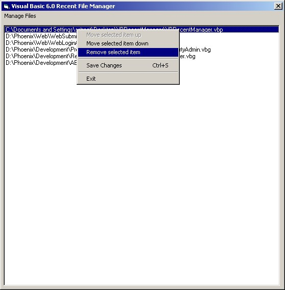



## Visual Basic Recent Project Manager

### Description

Ever want to remove an old project from your recent project list in the Visual Basic IDE? Or maybe change the order in which your VB IDE lists those projects. This simple little app does just that.

Please note: This application reads, writes and deletes from the registry! Also note, the application must be run as an executable to work; it will not work (save to the registry) while running in the VB IDE. Enjoy!
 
### More Info
 

             |
---                |---
**Submitted On**   |2002-07-01 12:42:12
**By**             |[Sean Street](https://github.com/Planet-Source-Code/PSCIndex/blob/master/ByAuthor/sean-street.md)
**Level**          |Beginner
**User Rating**    |4.7 (14 globes from 3 users)
**Compatibility**  |VB 6\.0
**Category**       |[Complete Applications](https://github.com/Planet-Source-Code/PSCIndex/blob/master/ByCategory/complete-applications__1-27.md)
**World**          |[Visual Basic](https://github.com/Planet-Source-Code/PSCIndex/blob/master/ByWorld/visual-basic.md)
**Archive File**   |[Visual\_Bas100681712002\.zip](https://github.com/Planet-Source-Code/sean-street-visual-basic-recent-project-manager__1-36441/archive/master.zip)

